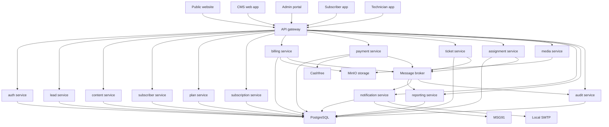

# Ashva Experts Unified Digital Ecosystem
## End-to-End Microservices Architecture Review and Implementation Blueprint
Version: 1.0  
Scope: Public Website + CMS, SaaS Operations Platform (Admin Web), Subscriber App, Technician App  
Core constraints: VPS deployment, Cashfree payments, MSG91 SMS, local SMTP, password + OTP, audit retention 90 days, single branch, English.

---

## 1. Objectives and Non-Negotiables

### 1.1 Business objectives
- Lead-driven public website with high conversion.
- CMS for lead pipeline and case studies with SEO metadata.
- SaaS operations platform to manage subscribers, plans, subscriptions, billing, payments, tickets, assignment, dashboards.
- Subscriber app for self-service (subscription, billing, pay, tickets, status, cancellation request).
- Technician app for jobs and completion proof (notes + photos).

### 1.2 Key rules
- Billing cycle is user-selectable as any integer number of months.
- Proration applies (starts mid-cycle, plan changes, pauses, cancel effects).
- Subscriber can pay in advance.
- GST invoicing with numbering and PDF generation.
- Cancellation requires one-month prior notice.
- SMS via MSG91; Email via local SMTP.
- Cashfree payment gateway with webhooks; support UPI/cards/netbanking; offline payment entry allowed.
- Audit logs retained for 90 days.

### 1.3 Microservices mandate
- Each major capability runs as an independently deployable service.
- Separate folder per service, with a README.md describing the service (purpose, APIs, data, config, runbook).
- Shared infrastructure is allowed (API gateway, IAM, observability, DB cluster), but business logic remains in services.

---

## 2. High-Level System Architecture

### 2.1 Component map
- Client applications
  - Public Website (Next.js) + CMS Admin UI
  - SaaS Admin Portal (Next.js)
  - Subscriber Mobile App (Flutter recommended)
  - Technician Mobile App (Flutter recommended)
- Edge and access
  - Nginx reverse proxy
  - API Gateway (internal, or Nginx routing + gateway service)
  - Auth service (password + OTP) issuing tokens
- Core microservices
  - Lead service
  - CMS content service (case studies)
  - Subscriber service
  - Plan service
  - Subscription service
  - Billing service (invoices, proration)
  - Payment service (Cashfree orchestration + webhooks)
  - Ticket service (install/service/repair)
  - Assignment service (technician job assignment)
  - Media service (uploads for photos, PDFs)
  - Notification service (MSG91 + SMTP)
  - Reporting service (dashboards, metrics projections)
  - Audit service (write-once append log)
- Data layer
  - PostgreSQL cluster (primary OLTP)
  - Redis (cache, rate limit, OTP throttling, job queues)
  - Object storage (MinIO S3 compatible on VPS) for images, ticket photos, invoice PDFs
- Async backbone
  - Message broker (Redis Streams or RabbitMQ)
  - Job workers (Celery or RQ) per service as needed
- Observability
  - Central logs (Loki) + dashboards (Grafana)
  - Metrics (Prometheus)
  - Tracing (OpenTelemetry, optional but recommended)

---

## 3. End-to-End Request Flows

### 3.1 Public website lead capture
1. Visitor opens public website pages.
2. Enquiry form submits to API Gateway.
3. Lead service validates and stores lead.
4. Notification service sends confirmation or internal alert if configured.
5. CMS Lead pipeline UI displays the lead and allows status changes.

### 3.2 Subscription creation and billing
1. Admin creates a plan and plan components.
2. Subscriber signs up and selects plan + billing_cycle_months.
3. Subscription service creates subscription record.
4. Billing service generates initial invoice with proration if needed.
5. Subscriber pays using Payment service, which creates Cashfree order and redirects or UPI intent.
6. Cashfree webhook hits Payment service.
7. Payment service validates signature and idempotency, then marks payment state and informs Billing service.
8. Billing service marks invoice paid and triggers invoice PDF generation via Media service.
9. Notification service sends receipt and confirmation.

### 3.3 Ticket and technician workflow
1. Subscriber raises a ticket.
2. Ticket service creates ticket and SLA metadata.
3. Admin assigns job to technician (Assignment service).
4. Technician app pulls assigned jobs.
5. Technician updates status and uploads completion photo to Media service.
6. Ticket service closes ticket and Notification service informs subscriber.

---

## 4. Domain-Driven Microservices Decomposition

### 4.1 Service boundaries
- Auth and identity is separate from business data.
- Billing and payments are separate; payments never directly mutate invoices without Billing service involvement.
- Ticketing is separate from assignment; assignment produces job allocations.
- Content and leads are separate from core SaaS operations.

### 4.2 Recommended microservices list
Minimum viable microservices for Day 1:
1. gateway-service
2. auth-service
3. lead-service
4. content-service
5. subscriber-service
6. plan-service
7. subscription-service
8. billing-service
9. payment-service
10. ticket-service
11. assignment-service
12. media-service
13. notification-service
14. reporting-service
15. audit-service

---

## 5. Data Architecture

### 5.1 Persistence strategy
- Use PostgreSQL as primary OLTP for most services.
- Microservices can either
  - Have their own schema in a shared PostgreSQL cluster, or
  - Have their own database within the same cluster.
- Strong recommendation: separate schema per service to enforce boundaries and simplify migrations.

### 5.2 Cross-service data consistency
- Use event-driven integration for side effects.
- Avoid distributed transactions.
- Apply the Outbox pattern:
  - Service writes its state and an outbox event in one DB transaction.
  - Worker publishes the event to the broker reliably.

### 5.3 Data ownership
- auth-service owns users, credentials, sessions, OTP events.
- subscriber-service owns subscriber profile and addresses.
- plan-service owns plan catalog and components.
- subscription-service owns subscription lifecycle.
- billing-service owns invoices, proration rules, invoice numbering.
- payment-service owns payment orders, webhook events, reconciliation.
- ticket-service owns tickets, SLA fields, status history.
- assignment-service owns job allocations to technicians.
- content-service owns case studies and SEO metadata.
- lead-service owns lead pipeline and attribution.
- audit-service owns audit log append store.

---

## 6. API Architecture

### 6.1 API Gateway responsibilities
- Route requests to correct services.
- Enforce TLS, WAF-like rate limits, IP allow lists for admin if needed.
- Validate JWT access tokens for protected routes.
- Request correlation IDs.
- Basic request size limits and upload routing to media-service.

### 6.2 Auth model
- Password + OTP verification at login.
- JWT access token with short TTL.
- Refresh token stored securely.
- Roles embedded as claims or fetched from auth-service.

### 6.3 Standard API conventions
- REST JSON for synchronous calls.
- Idempotency keys for create and payment operations.
- Pagination with limit and cursor.
- Standard error envelope:
  - code
  - message
  - details
  - correlation_id

---

## 7. Payments and Invoicing Deep Dive

### 7.1 Payment state machine
- created
- pending
- success
- failed
- cancelled
- refunded optional

### 7.2 Webhook handling
- Verify Cashfree signature.
- Enforce idempotency per event_id or order_id.
- Store raw event payload in payment_webhook_events.
- Only after validation, emit PaymentSucceeded or PaymentFailed events to broker.

### 7.3 Invoice numbering
- A single authoritative sequence in billing-service.
- Format example:
  - FY26-27-INV-000001
- Invoice PDF is generated after invoice is finalized and payment is confirmed.

### 7.4 Proration and advance payments
- Proration rules stored in billing-service configuration:
  - daily proration on monthly basis
  - rounding rules
  - plan change effective date
- Advance payments are stored as credits:
  - billing-service maintains subscriber credit ledger
  - future invoices can auto apply credit

---

## 8. Ticketing and SLA Deep Dive

### 8.1 Ticket types
- installation
- service
- repair

### 8.2 Status model
- created
- assigned
- in_progress
- completed
- closed
- cancelled optional

### 8.3 SLA configuration
- admin-configurable per ticket type and priority.
- SLA timers computed by ticket-service.
- escalation events emitted to notification-service if breached.

### 8.4 Technician completion proof
- Photos uploaded to media-service.
- Notes stored in ticket-service status history or completion notes table.

---

## 9. Notifications

### 9.1 Channels
- SMS via MSG91
- Email via local SMTP
- WhatsApp optional future

### 9.2 Trigger events
- lead created
- invoice generated
- payment success
- payment failed
- due reminder
- overdue reminder
- ticket created
- job assigned
- job completed
- cancellation request created

### 9.3 Template management
- notification-service maintains templates with variables.
- Version templates for auditability.

---

## 10. Observability, Security, and Compliance

### 10.1 Audit logs
- audit-service exposes append endpoint for services.
- Each service submits audit events for key actions.
- Retention: 90 days enforced by scheduled purge.

### 10.2 Logging and metrics
- Structured JSON logs with correlation_id.
- Prometheus metrics per service.
- Grafana dashboards for:
  - API latency
  - error rates
  - payment webhook failures
  - invoice generation jobs
  - notification delivery rates

### 10.3 Security controls
- Rate limiting on auth and OTP endpoints.
- Input validation and output encoding in all services.
- Webhook signature validation in payment-service.
- Secrets stored in environment variables or vault-like mechanism.
- Strict CORS policy for admin and apps.

### 10.4 Data protection
- Password hashing using bcrypt or argon2.
- PII field encryption at rest optional.
- Access logs for admin endpoints.
- Backup encryption.

---

## 11. VPS Deployment Topology

### 11.1 Recommended deployment approach
- Docker Compose for initial MVP on VPS.
- Each microservice runs as its own container.
- Use a dedicated internal docker network.
- Nginx acts as reverse proxy and TLS terminator.

### 11.2 Environments
- staging and production on separate VPS or at least separate docker compose stacks.
- Separate databases and object storage buckets per environment.

### 11.3 Backups
- Nightly PostgreSQL dump + WAL archiving if possible.
- MinIO bucket backups or snapshots.
- Backup retention policy aligned with business needs.

---

## 12. Repository and Folder Structure

Top-level structure:
- services
  - gateway-service
  - auth-service
  - lead-service
  - content-service
  - subscriber-service
  - plan-service
  - subscription-service
  - billing-service
  - payment-service
  - ticket-service
  - assignment-service
  - media-service
  - notification-service
  - reporting-service
  - audit-service
- apps
  - web-public
  - web-admin-portal
  - web-cms
  - mobile-subscriber
  - mobile-technician
- infra
  - nginx
  - docker-compose
  - db-migrations
  - observability
- docs
  - architecture
  - api
  - runbooks

### 12.1 Required per-service folder layout
Each service folder must contain:
- README.md
- src
- tests
- Dockerfile
- config
  - example.env
- migrations
- openapi
  - openapi.yaml
- scripts
  - dev-run.sh
  - healthcheck.sh

---

## 13. Per-Service README Template
Every service README.md must include the following sections:

1. Service overview
2. Responsibilities and boundaries
3. Owned data and schema
4. Public APIs and example requests
5. Events published and events consumed
6. Environment variables and secrets
7. Local development instructions
8. Deployment notes
9. Health checks and SLOs
10. Runbook:
   - common failures
   - log locations
   - recovery steps
11. Security notes:
   - auth requirements
   - rate limits
   - PII handling

---

## 14. Service Specifications

### 14.1 gateway-service
Responsibilities:
- Routes traffic to microservices.
- Enforces auth validation for protected endpoints.
- Rate limiting and request size limits.
Key endpoints:
- No business endpoints; it proxies.
Dependencies:
- auth-service for token introspection if needed.

### 14.2 auth-service
Responsibilities:
- User registration and login.
- Password + OTP verification.
- Token issuance and refresh.
Data:
- users, roles, user_roles, otp_events, sessions.
Events:
- UserCreated, UserLoggedIn.

### 14.3 lead-service
Responsibilities:
- Store and manage leads.
- Lead pipeline workflow New to Closed.
Data:
- leads, lead_activities.
Events:
- LeadCreated.

### 14.4 content-service
Responsibilities:
- Case study CRUD with SEO metadata.
- Public listing and detail fetch by slug.
Data:
- case_studies.
Events:
- CaseStudyPublished.

### 14.5 subscriber-service
Responsibilities:
- Subscriber profile, contact, address.
Data:
- subscribers, subscriber_addresses.
Events:
- SubscriberCreated, SubscriberUpdated.

### 14.6 plan-service
Responsibilities:
- Plan catalog and components.
Data:
- plans, plan_components.
Events:
- PlanUpdated.

### 14.7 subscription-service
Responsibilities:
- Subscription lifecycle and billing cycle selection.
Data:
- subscriptions, subscription_events.
Events:
- SubscriptionCreated, SubscriptionChanged, SubscriptionPaused, SubscriptionCancelled.

### 14.8 billing-service
Responsibilities:
- Invoice generation.
- Proration rules.
- Credit ledger for advance payments.
- GST invoice numbering and PDF generation trigger.
Data:
- invoices, invoice_line_items, credit_ledger, invoice_sequences.
Events:
- InvoiceGenerated, InvoicePaid, InvoiceOverdue.

### 14.9 payment-service
Responsibilities:
- Create Cashfree orders.
- Handle webhooks.
- Store payment attempts and statuses.
- Trigger reconciliation events.
Data:
- payments, payment_orders, payment_webhook_events, offline_payments.
Events:
- PaymentSucceeded, PaymentFailed.

### 14.10 ticket-service
Responsibilities:
- Ticket CRUD.
- SLA timers and status history.
Data:
- tickets, ticket_status_history, sla_configs.
Events:
- TicketCreated, TicketStatusChanged, SlaBreached.

### 14.11 assignment-service
Responsibilities:
- Assign technicians to tickets.
- Maintain job queue per technician.
Data:
- ticket_assignments.
Events:
- JobAssigned.

### 14.12 media-service
Responsibilities:
- Secure upload and download of:
  - ticket photos
  - invoice PDFs
  - website media
Data:
- media_objects metadata, MinIO storage.
Events:
- MediaUploaded.

### 14.13 notification-service
Responsibilities:
- Send SMS and email.
- Template management.
- Delivery logs and retries.
Data:
- templates, delivery_logs.
Events:
- NotificationSent, NotificationFailed.

### 14.14 reporting-service
Responsibilities:
- Dashboard queries and aggregates.
- Read optimized projections for performance.
Data:
- reporting tables or materialized views.
Events:
- Consumes core events to build projections.

### 14.15 audit-service
Responsibilities:
- Central append-only audit store.
- Query API for admin.
- Retention enforcement.
Data:
- audit_logs.
Events:
- None, it stores.

---

## 15. Mermaid End-to-End Architecture Diagram

---

## 16. Implementation Standards and Guardrails

### 16.1 Microservice standards
- Each service has independent:
  - Docker image
  - migration scripts
  - versioning
  - health endpoint
  - OpenAPI spec
- Inter-service calls:
  - Prefer events for side effects.
  - Synchronous calls only for critical reads.

### 16.2 Idempotency and reliability
- Payment and invoice operations must accept Idempotency-Key.
- Webhooks must be idempotent.
- Outbox pattern for publishing events.

### 16.3 Security baseline
- Central auth.
- JWT validation at gateway.
- Rate limit auth endpoints.
- Validate uploads and restrict file types.

---

## 17. Deliverables Checklist
This architecture implies the following deliverables exist in the repository:
- Full folder skeleton for services and apps.
- README.md in each service folder with standard template sections.
- Docker Compose in infra/docker-compose.
- Nginx configuration in infra/nginx.
- OpenAPI specs for all services.
- Database migrations per service schema.
- Observability stack configs in infra/observability.

---

## 18. Next Decisions
If you confirm the below, the architecture can be converted into repo scaffolding and API specs:
1. Backend language preference: Python FastAPI is assumed.
2. Message broker choice: Redis Streams vs RabbitMQ.
3. Database approach: shared PostgreSQL cluster with schema per service is assumed.
4. Mobile framework: Flutter is assumed.
